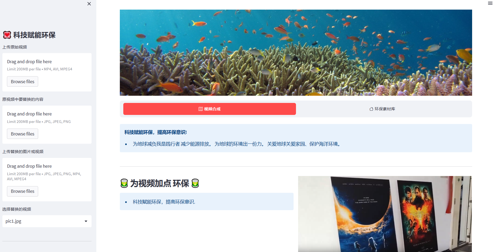
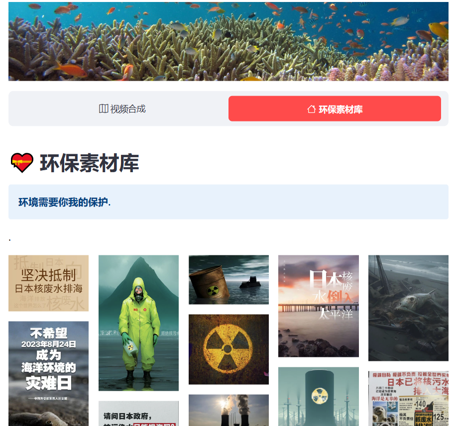

# technology for environmental protection
# 技术为环保赋能

## 背景
- 8月24号日本正式向大海排放核废水。 
- 视频博主被日本核废水话题被限流。

因此就有了开发这个项目的冲动，我们也想为环保做一些自己的事情。
        

### 服务对象：
视频博主 （环保理念）

我们用技术手段，来为他们的视频增加一点 “环保” , 不被限流               

### 开发理念
                
**环保不适合商业广告的频重复**

环保意识的培养不在于声音大， 而在与频率高  
我们目标是通过为博主的视频中无痕添加一些环保元素，**弱化说教**味道，将环保从言传向身教转变。
主打一个**潜移默化**。

                
### 技术选型
                
视频元素替换模型 中的 佼佼者——[NeuralMarker]("https://arxiv.org/pdf/2209.08896.pdf") （感谢作者开源的模型）
                
前端轻量化框架——streamlit     

[项目完整数据和模型]("https://pan.baidu.com/s/185h20PqybZ6VbafJzyB0kQ?pwd=1oy2)

### 备注
本项目向 2023年 Google 开发者大会 黑客松 赛的参赛项目。

### 页面截图

